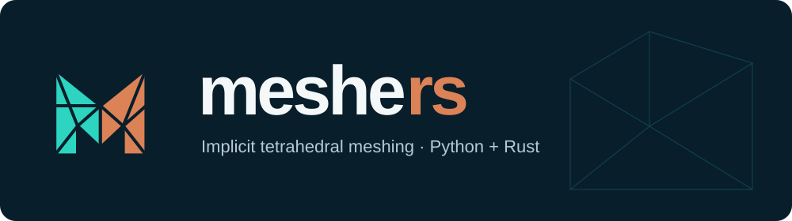

<p align="center"></p>

# Meshers

CPU tetrahedral meshing of implicit solids and TPMS geometries, with Python and
Rust APIs. Version 0.1 supports custom and graded fields, periodic boundaries,
named intersections, and curved coordinate maps.

```python
import meshers

mesh = meshers.generate("gyroid", band=(-0.5, 0.5), cells=24, periodic=(True, True, True))
mesh.write_vtkhdf("gyroid.vtkhdf")
```

The candidate is not yet published on PyPI. Install a tested wheel with
`python -m pip install /path/to/meshers.whl h5py`. Wheels require Python 3.10+
and NumPy. Rust is only needed to build from source; h5py is optional for export.

- [Installation and first mesh](docs/site/getting-started.md)
- [Runnable Python examples](docs/site/examples.md)
- [Python API](docs/site/api/python.md) and [Rust API](docs/site/api/rust.md)
- [Quality and limits](docs/site/quality.md)
- [Performance checks](docs/site/performance.md)
- [Contributing](docs/site/contributing.md) and [release checks](docs/site/release.md)

Supported NumPy expressions compile automatically with derivatives. Other
pointwise functions use bounded NumPy callbacks. Meshes contain owned arrays
for points, tetrahedra, boundary triangles and periodic node pairs. Named
intersections also retain constraint labels and feature edges.

Resolution and geometry tolerances must suit your smallest features. Sampling
cannot certify every geometry; inspect quality and check application convergence.

## Develop

Use Python 3.12+, uv and Rust 1.95 or newer.

```sh
uv sync --locked --all-packages --group docs
uv run pytest crates/meshers-python/tests tools/tests
uv run ruff check
uv run ruff format --check
uv run ty check
cargo test --locked --release
uv run --group docs python tools/build_docs.py
```

## License

Meshers is [MIT licensed](LICENSE). Bundled dependencies retain their own
licenses; Python distributions include their notices.
