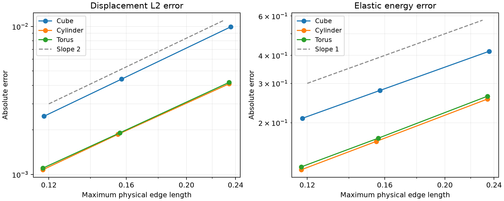

# Solver verification

The release candidate has been exercised with an independent P1 tetrahedral
linear-elasticity assembly on a cube, cylindrical gyroid sheet and toroidal
gyroid sheet. Each specimen uses three background resolutions; the TPMS cases
use the public Python constrained-intersection API and eight quality passes.

This is a manufactured-solution study with Lamé constants lambda = mu = 1.
The exact displacement is `(sin(pi*x) sin(pi*y) sin(pi*z), 0, 0)`, with body
forces derived from the Navier elasticity equation and exact displacement
prescribed at every boundary node. Four-point tetrahedral quadrature integrates
the load and sampled errors. Affine displacement patch tests independently
check assembly and boundary handling on all three geometries.

| Geometry | Background levels | L2 displacement error, coarse → fine | Energy error, coarse → fine | Final observed orders, L2 / energy |
| --- | --- | ---: | ---: | ---: |
| Cube | 6, 9, 12 | 0.00994 → 0.00247 | 0.417 → 0.209 | 2.01 / 1.00 |
| Cylindrical TPMS | 12, 18, 24 | 0.00410 → 0.00108 | 0.255 → 0.123 | 1.97 / 1.05 |
| Toroidal TPMS | 12, 18, 24 | 0.00419 → 0.00110 | 0.263 → 0.127 | 1.92 / 1.03 |

Orders use the measured maximum physical edge length. Displacement errors
fall approximately quadratically and energy errors approximately linearly in
these runs. Affine patch L2 errors are below 3e-11 and energy errors below
1.2e-9. All physical tetrahedral volumes are positive.

SciPy conjugate gradients with a diagonal preconditioner converged for all
systems, with explicitly recomputed relative residuals below 1e-10. The largest
refinement has about 84,000 tetrahedra and 16,400 free displacement degrees of
freedom for each TPMS specimen. The implementation checks matrix symmetry,
positive diagonal entries, solver status and residuals.
See the [SciPy CG API](https://docs.scipy.org/doc/scipy/reference/generated/scipy.sparse.linalg.cg.html)
for solver tolerance semantics.



## Fedoo verification

The same nine meshes have also been solved with **fedoo 0.8.4**, using the
installed 0.1.0 release-candidate wheel on the same Apple M4. Fedoo constructs
its own `tet4` stiffness and load assemblies through `StressEquilibrium` and
`DistributedLoad`, applies the Dirichlet conditions and solves through
`problem.Linear`. `ElasticIsotrop(E=2.5, nu=0.25)` gives the same Lamé constants.
Body forces are evaluated at fedoo's four Gauss points per element, avoiding
nodal interpolation of the analytic load.

| Geometry | Final displacement order | Final energy order |
| --- | ---: | ---: |
| Cube | 2.006 | 0.997 |
| Cylindrical TPMS | 1.975 | 1.050 |
| Toroidal TPMS | 1.920 | 1.033 |

All three affine patch tests pass. Across the nine refinement solves, the
fedoo displacement and energy error norms agree with a fresh independent
assembly on each identical mesh to within 5e-13 relative difference. The script
checks prescribed displacement values, positive signed volumes, matrix symmetry,
positive diagonals and the explicitly recomputed free-equation residual.
Convergence-rate assertions require final orders above 1.7 and 0.85.

Fedoo uses its supported SciPy CG backend here, with a diagonal preconditioner
and the same tolerances as the independent study. Thus this checks the **fedoo
mesh/assembly/load/boundary-condition integration**, while sharing the sparse
solver backend and analytic error integration. It is not an independent test
of a different linear solver. This manufactured-solution study does not exercise
periodic constraints; the separate [periodic homogenization study](periodic-homogenization.md)
uses fedoo 1.0.0b2 to test those.
See the [fedoo quick start](https://3mah.github.io/fedoo-docs/Quick_Start.html)
for its assembly, problem and solver interfaces.

## What this establishes

These specimens support a useful first claim: the generated tetrahedra can
produce convergent linear-elasticity solutions with the expected observed
rates in this controlled setting. Merely accepting a mesh or reporting positive
quality would not establish that.

The manufactured-solution study does **not** establish effective stiffness or
Poisson ratios, nonlinear mechanics, conditioning under other material laws,
or parity with Microgen's VTK/MMG pipeline. Boundary data are imposed on every
boundary, including end faces; this study does not exercise rotational vector
constraints in the solver. Errors are measured on each discrete polyhedral
domain, so they do not isolate convergence of geometry approximation to the
analytic curved domain. No MMG comparison was run.

## Reproduce

Install the candidate wheel, NumPy and SciPy, then run from the repository:

```sh
uv run --with scipy python demos/solver/convergence.py
```

The script includes assertions and writes `docs/solver-convergence-results.json`.
[Source](https://github.com/kmarchais/meshers/blob/main/demos/solver/convergence.py)
and [raw measurements](https://github.com/kmarchais/meshers/blob/main/docs/solver-convergence-results.json)
are retained with the release preparation. Measurements were made on an Apple
M4 (4 performance + 6 efficiency cores), 24 GiB RAM, macOS 26.5.1 arm64.
Timings are observations under development load, not controlled benchmarks.

To reproduce the fedoo study with the candidate wheel installed:

```sh
uv run --with fedoo==0.8.4 python demos/solver/fedoo_convergence.py
```

This writes `docs/fedoo-convergence-results.json`; the original independent
report is preserved. CI runs both studies and uploads both reports. The fedoo
run compares against a freshly assembled independent solution at every level.
[Source](https://github.com/kmarchais/meshers/blob/main/demos/solver/fedoo_convergence.py)
and [raw fedoo measurements](https://github.com/kmarchais/meshers/blob/main/docs/fedoo-convergence-results.json)
include dependency versions and source/extension hashes.
